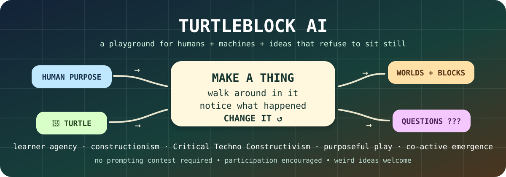

# 🐢🎨 TurtleBlock AI backstage

This little `.github` repository is the **paintbox, porch light, and public costume closet** for the TurtleBlock AI organization.

It is not the main machine. It is where we decide how the machine waves hello.

<p align="center">
  
</p>

## Three rooms, three jobs

| Room | What it should feel like | Go there |
|---|---|---|
| 🏡 **Organization profile** | The front porch: warm, strange, inviting, immediately playable | [`profile/README.md`](./profile/README.md) |
| 🔧 **Platform repository** | The workshop floor: code, WorldSpec, Turtle Terraria, tests, build notes, experiments | [turtleblockai/platform](https://github.com/turtleblockai/platform) |
| 🌎 **Live playground** | The place where the ideas leave Markdown and start moving around | [turtleblockai.com](https://turtleblockai.com) |

## House rule

The public face should behave like the project itself:

```text
idea
  ↓
make something visible
  ↓
walk around in it
  ↓
notice what happened
  ↓
change it
  ↺
```

That means these READMEs do **not** need to agree word-for-word. In fact, they probably should not.

The organization page can be an invitation.
The platform README can be a workbench.
This repository can be the backstage scribble on the wall that says:

> **DO NOT POLISH AWAY THE INTERESTING PARTS.**

## Current visual language

- blocks, loops, arrows, little machines, maps, terraria, diagrams
- human purpose stays visibly different from Turtle interpretation
- research provenance stays visible without turning every doorway into a bibliography
- unfinished things may look unfinished
- playfulness is allowed to carry serious ideas
- “I don’t know yet” is valid interface text
- if the README starts to look like enterprise middleware documentation, somebody should release a turtle into it

## Public ingredients

The visual and conceptual ingredients come from the project itself:

- Critical Techno Constructivism
- constructionism and computational microworlds
- STEAMHAMLET
- Purposeful Play
- Possible Possibles
- Co-active Emergence
- WorldSpec
- Turtle Charter
- Turtle Terraria
- Build in Public

No separate branding mythology is required. The research program is already wonderfully weird enough. 🐢
