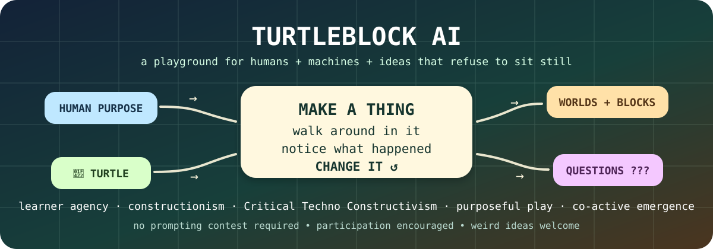

# 🐢 TurtleBlock AI organization backstage

This `.github` repository controls the **public front porch** of the TurtleBlock AI GitHub organization.

The project has grown enough that the porch, workshop, and live research environment now need distinct jobs.

<p align="center">
  
</p>

## Three public layers

| Layer | Job | Canonical location |
|---|---|---|
| 🏡 **Organization profile** | Explain the project to a new visitor without requiring repo archaeology | [`profile/README.md`](./profile/README.md) |
| 🔧 **Platform repository** | Document the actual architecture, code, migrations, tests, research contracts, and current implementation | [`turtleblockai/platform`](https://github.com/turtleblockai/platform) |
| 🌎 **Live site** | Let people enter the research environment: Try It, Research, Research Library, Turtle Terraria, WorldSpec, Charter, Build Log | [`turtleblockai.com`](https://turtleblockai.com) |

The READMEs should agree on facts and architecture while serving different audiences.

The organization page is an invitation.

The platform README is the workbench manual.

The live site is where the ideas have to survive contact with actual use.

---

## Current canonical story

TurtleBlock AI is a public educational research project exploring how people and computational agents can **build, inhabit, question, compare, and revise ideas together** without collapsing human purpose into machine interpretation.

The project now includes:

- **WorldSpec** — inspectable, revisable representation between human meaning and computational construction;
- **Turtle Charter** — behavioral and agency boundaries for Turtle;
- **Turtle Terraria** — the expanded research environment that grew out of Turtle Lab;
- **Human + Turtle Terrarium** — human-driven inquiry and construction;
- **Recursive Turtle Terrarium** — explicitly synthetic self-play with no autonomous production authority;
- **Human Tamagotchi Terrarium + TurtleAsk** — a research condition in which Turtle may eventually seek genuine human perturbation through a separate consent/attention gate;
- **Selective Attention** — noticing is not permission to interrupt;
- **Plural Foregrounds** — shared worlds do not require machine-manufactured consensus;
- **Human Perturbation Translation** — human input must survive machine interpretation with provenance intact;
- **Branch Experience Comparison** — alternate builds can be compared without automatically selecting a winner;
- **Cross-Branch Perturbation** — one branch can lend another a question without merging its history;
- **Persistent Perturbation** — long-running machine initiative must remain learner-contestable and revocable;
- **Sanders Research Ontology** — immutable dissertation source layer plus later provenance-aware research concepts and operational mappings;
- **Research Library** — a public D1-backed catalog preserving photographed physical sources, editions, special notes, artifact provenance, and research connections;
- **Build Log + Next Edge** — completed work separated from the living future-facing research question.

The package remains deliberately conservative at **v0.1.0** until implemented and tested capability earns a larger version claim.

---

## Language rules that matter

### Turtle Lab → Turtle Terraria

The canonical transition is:

```text
Turtle Lab
   ↓ expanded into
Turtle Terraria
```

Do not describe this as “Terraria became Terraria.”

### Human and machine traces remain distinct

```text
human intention
  ≠ Turtle interpretation
  ≠ synthetic self-play
  ≠ WorldSpec state
  ≠ world observation
  ≠ scholarly source
  ≠ later ontology mapping
```

They may be related. They should not be silently collapsed.

### Build Log and Next Edge are different things

- **Build Log** = completed, committed work.
- **Wait a minute…** = an evidence-backed connection discovered around completed work.
- **Next Edge** = one open question beyond the latest completed work.
- **Possible Possibles** = alternate futures worth preserving.
- **X-factor** = explicit room for the not-yet-classifiable.

Current traditional X-factor language:

> **whoooo knooooowwwssssssssssss**

---

## Visual and editorial language

The public face should feel like the project:

- blocks, loops, arrows, worlds, terraria, branches, traces, questions;
- playful without becoming unserious;
- research-grounded without turning every doorway into a bibliography;
- provisional things may look provisional;
- failures and reversals remain visible when they teach something;
- “I don’t know yet” is acceptable interface language;
- learner agency should be visible in both prose and architecture;
- no claim of machine consciousness is required for interesting machine behavior;
- if documentation begins to sound like generic enterprise AI middleware, release a turtle into it.

---

## Research lineage

The public story should preserve the longitudinal argument rather than presenting TurtleBlock AI as a sudden AI product.

```text
Logo / learning-by-making
        ↓
Dewey + Freire + Papert
        ↓
Critical Techno Constructivism
        ↓
experimental classroom practice
        ↓
Minecraft + Purposeful Play
        ↓
STEAMHAMLET
        ↓
Engaging with AI
        ↓
Co-active Emergence
        ↓
persistent computing environments
        ↓
WorldSpec + Turtle Charter + Turtle Terraria
        ↓
TurtleBlock AI
```

The original dissertation Dedoose code layer remains a protected source layer. Later Sanders-authored work is additive and provenance-aware.

---

## Canonical short organization description

The GitHub organization profile metadata should use a concise description that now matches the mature project:

> **Researching how people and computational agents build, inhabit, question, and revise worlds together. WorldSpec · Turtle Terraria · CTC · Minecraft.**

Canonical website:

> **https://turtleblockai.com**

The GitHub connector used by the project can update repository files but currently does not expose the organization-profile metadata field itself, so that one line may still require a manual GitHub profile edit.

---

## House rule

When the public profile, platform README, live site, research architecture, and repository state diverge, treat the divergence as a defect.

But do not solve that by making every surface identical.

Each surface should preserve the same **truth** while speaking for its own room.

> **DO NOT POLISH AWAY THE INTERESTING PARTS.**
